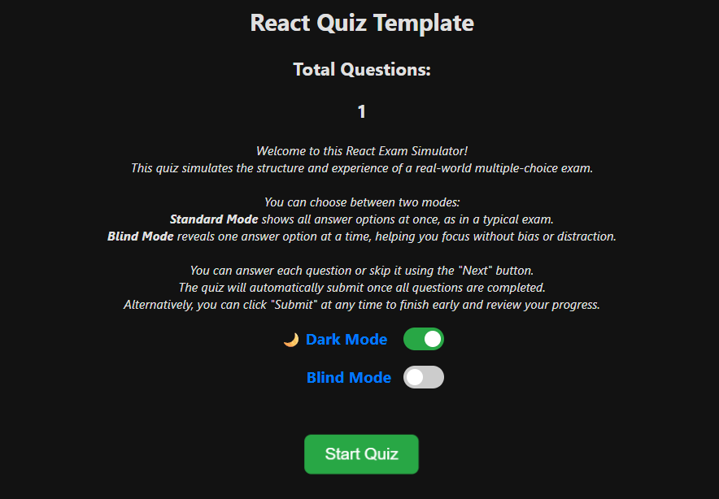

# React Quiz Template

### 🔹 React-Based Certification Quiz Template

This project is a **certification exam simulator** built with [React](https://react.dev/). It's designed to help learners practice for multiple-choice exams in a realistic and interactive environment.

### 🔍 Preview

Here’s what the simulator looks like:

### Landing Page


### Standard Mode


### Blind Mode


### Quiz Results


#### 🧠 About the Quiz

- You earn **1 point** only if:
  - You select **all correct answers**
  - And **none of the incorrect ones**
- Skipping or selecting incorrectly = **0 points**
- At the end, you'll see:
  - Your **total score**
  - A **detailed review** showing your answers vs the correct ones

---

#### 🎮 Available Quiz Modes

- **Standard Mode** – shows all answer options at once (like a real exam)
- **Blind Mode** – shows one option at a time, helping reduce bias and increase focus

You can switch between modes before starting the quiz.

---

#### 🚀 Start the Quiz

You can try the live simulation here: [Start CyberArk Exam Simulator](https://cyberark-exam-simulator.vercel.app/)

---
#### 🛠️ How to Run the Quiz Simulator locally

> Requires: **Node.js** and **Git**  
> ▸ [Install Node.js](https://nodejs.org/)  
> ▸ [Install Git](https://git-scm.com/downloads)

1. Verify Node.js and Git are installed:
   ```pwsh
	node -v
	git
	 ```

2. Clone the repository:
	```pwsh
	git clone https://github.com/gvnadir/React-Quiz-Template.git
	```

3. Install dependencies:
	```pwsh
	npm install
	```

4. Start the development server:
	```pwsh
	npm start
	```

5. Open the app in your browser:
	```pwsh
	http://localhost:3000
	```

---

#### ✏️ How to Add or Modify Questions

All quiz questions are stored in the following file:

`src/data/questions.json`


To add a new question:

1. Stop the development server (`Ctrl + C` in your terminal)
2. Open `questions.json`
3. Add a new question object to the JSON array using this format:

	```json
	{
		"text": "Your question goes here",
		"options": ["Answer A", "Answer B", "Answer C", "Answer D"],
		"correct": [0, 3] 
	}
	```

4. Restart it by running:
	```pwsh
	npm start
	```

---

#### ☁️ How to Deploy on Vercel

You can easily deploy this React quiz template using [Vercel](https://vercel.com), a fast and free hosting platform for frontend apps.

##### 🔧 Steps to deploy:

1. Go to [https://vercel.com](https://vercel.com) and sign in with your GitHub account.
2. Click **"New Project"** and import your fork of this repository.
3. Vercel will automatically detect the React app and pre-fill the configuration.
4. Click **"Deploy"**.
5. After deployment, your quiz simulator will be available at a public URL like: